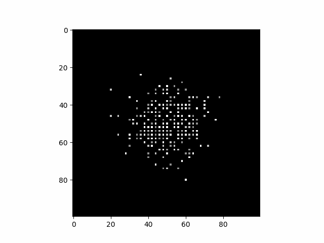

# Eric Connelly's Github

<!--- --->

### About Me
I am currently looking for a role as a Data Scientist. I have a background in Mathematics. I recieved my Bachelor's Degree in Mathematics from The College of Staten Island. 
I am currently a Math/ Statistics/ Data Analysis Tutor at The Fashion Institute of Technology where I also contribute puzzles to their newsletter.

Message me on Linkedin!

[LinkedIn](https://www.linkedin.com/in/eric-connelly-685525212/)
<!--- 

My Website:

https://eric-conn.github.io/

### Projects

[Rotator Tool](https://github.com/Eric-Conn/RotatorApp/tree/main)

[Graph Builder](https://eric-conn.github.io/GraphMaker/GraphMaker.html)

[Compass and Straightedge Tool](https://eric-conn.github.io/CompassStraightedge_vector.html)

<!--## Resume

Check out my resume:

[My Resume](https://github.com/Eric-Conn/Resume/blob/main/Eric_Connelly_Resume.pdf)
-->

<!--
Recent Blog Post:
[Box Cox Post](https://eric-conn.github.io/BoxCoxPost/final/BoxCoxPost_final_post)

## My Portfolio

### Data Science and Machine Learning

Some of my projects are analyzing time series data for the NYC Ferry System, forecasting US food import value, and analyzing lottery data.

Analyzing the Staten Island Ferrry Ridership dataset:
[Staten Island Ferry Time Series Analysis](https://github.com/Eric-Conn/StatenIslandFerryProject/blob/main/StatenIslandFerry_Notebook.ipynb)

Notebook about making predictions using time series data: 
[NYC Ferry Time Series Forecasting](https://github.com/Eric-Conn/NYCFerryData_TimeSeriesForecasting/blob/master/FerryDataFinalReport.ipynb)

IDNYC Data Analysis Blog Post:
[Blog Post](https://eric-conn.github.io/IDNYC_Post)

IDNYC Data Analysis Notebook:
[Notebook](https://github.com/Eric-Conn/IDNYC_Project/blob/main/IDNYC_Notebook.ipynb)

Comparing regular gradient descent versus heavy ball gradient descent:
[Gradient Descent Notebook Github](https://github.com/Eric-Conn/GradientDescent/blob/master/GradientDescent.ipynb)

Handwritten digit classifier using Convolutional Neural Networks : 
[Handwritten Digit Recognizer Github](https://github.com/Eric-Conn/DigitRecognizer/blob/master/digitrecognizer.ipynb)

Notebook about The Mega Millions Lottery:
[Mega Milions Lottery Notebook Github](https://github.com/Eric-Conn/MegaMillionsAnalysisProject/blob/master/Lottery_Notebook.ipynb)

Notebook about US Food Imports:
[Food Imports Notebook Github](https://github.com/Eric-Conn/USFoodmportsProject/blob/master/FoodImportsNotebook.ipynb)

Notebook about creating higher degree features from a numerical column in a dataframe: 
[Higher Degree Features Notebook Github](https://github.com/Eric-Conn/CreatePolynomialFeatures/blob/master/createpolyfeatures.ipynb)

### Math

One of my projects is about the properties of a certain collection of graphs. Not done yet.

simple drawing tool:
[Simple Drawing Tool](https://eric-conn.github.io/DrawingApp/index3.html)

--->

